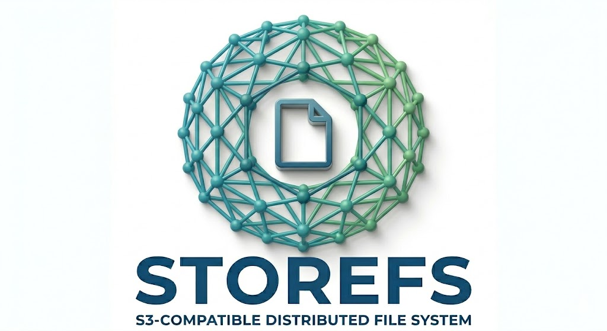
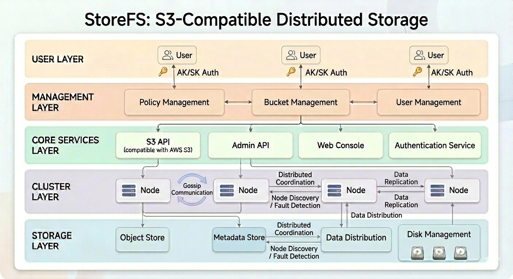

**[查看中文版](README_cn.md)**

<p align="center">
  
</p>

# StoreFS - Distributed S3-Compatible Storage System

## Index
- [Overview](#overview)
- [Installation and Deployment](#installation-and-deployment)
- [Management Console](#management-console)
- [S3 API](#s3-api)
- [Admin API](#admin-api)
- [Quick Start](#quick-start)
- [Technical Support](#technical-support)
- [License](#license)

## Overview

StoreFS is a distributed S3-compatible storage system implemented in Go language, using gossip protocol for cluster membership management and communication. The system supports dynamic node management, data distribution, and fault tolerance functions, providing users with high-performance, scalable object storage services.
This project uses Claude Code to automatically generate all codes and documentation.

### Core Features

- **S3-Compatible API**: Compatible with AWS S3 API, supporting AWS CLI and other S3 tools
- **Distributed Architecture**: Node discovery and communication through gossip protocol
- **Dynamic Scalability**: Supports adding/removing nodes freely without downtime
- **High-Performance Storage**: Optimized storage engine supporting multiple storage media
- **Fault Tolerance**: Data automatically recovers when nodes fail
- **Load Balancing**: Requests are automatically distributed to available nodes
- **Web Management Console**: Provides an intuitive web interface to manage users, policies, buckets, and objects
- **Multi-Language Support**: Management console supports Chinese and English

### Core Concepts

- **User**: System user with a unique identity. Each user can have different roles, which determine the user's permission scope. Users authenticate using Access Key (AK) and Secret Key (SK).

- **Policy**: Defines a user's access permissions to buckets and objects. Policies can precisely control user operations such as read, write, list bucket contents, delete objects, etc.

- **Bucket**: Container for storing objects. Each bucket has a unique name, and users can create, delete, and manage objects within buckets. Buckets can be configured with access policies to control which users can access them.

### Cluster Architecture

A StoreFS cluster consists of multiple nodes that communicate through the gossip protocol:

- **Dynamic Node Management**: Supports adding/removing nodes freely without downtime
- **Data Distribution**: Object data is distributed to multiple nodes according to policies
- **Fault Tolerance**: Data automatically recovers when nodes fail
- **Load Balancing**: Requests are automatically distributed to available nodes



## Installation and Deployment

### 1. Configuration File Details

StoreFS uses a YAML format configuration file (config.yaml). Here is a detailed explanation of the configuration items:

```yaml
cluster:
  name: mycluster              # Cluster name, all nodes must use the same name
  db:                          # Database configuration (using StarRocks as metadata storage)
    host: "127.0.0.1"          # Database host address
    port: 9030                 # MySQL query port
    user: "root"               # Database username
    password: ""               # Database password
    database: "mydb"           # Database name
    timeout: 10s               # Connection timeout
  node:                        # Current node configuration
    name: node1                # Node name, must be unique
    num: 1                     # Node number, must be unique
    ip: 127.0.0.1              # Node IP address
    port: 7946                 # Reuse port. Admin REST API, admin web console, and node communication port (gossip protocol) all use this port
    internal_port: 17946       # Internal port for file operations between nodes
    disks:                     # Node disk configuration
      - path: /path/to/disk1   # Disk path
        weight: 1              # Disk weight for data distribution strategy
      - path: /path/to/disk2
        weight: 1
    s3:                        # S3 API configuration
      host: 127.0.0.1          # S3 API host address
      port: 8901               # S3 API port
  seeds:                       # Cluster seed node list (for node discovery)
    - 127.0.0.1:7946
    - 127.0.0.1:7947
    - 127.0.0.1:7948
```

### 2. Physical Machine/Cloud Virtual Machine Deployment

#### Step 1: Deploy Database

StoreFS uses StarRocks as metadata storage, so StarRocks needs to be deployed first:

```bash
# Download and start StarRocks (single-node deployment)
wget https://repos-starrocks.azureedge.net/starrocks/4.0.7/StarRocks-4.0.7.tar.gz
tar -xzf StarRocks-4.0.7.tar.gz
cd StarRocks-4.0.7

# Start FE (Frontend)
./fe/bin/start_fe.sh --daemon

# Start BE (Backend)
./be/bin/start_be.sh --daemon

# Initialize metadata (using MySQL client to connect)
mysql -h db -P9030 -uroot < /init.sql
```

#### Step 2: Prepare Configuration File

Create a configuration file for each node (such as config1.yaml, config2.yaml, etc.), ensuring that `node.name` and `node.num` are unique for each node.

#### Step 3: Start StoreFS Nodes

```bash
# Download the StoreFS binary file for the corresponding platform
e.g., storefs_linux_x86_64

# Start node 1
./storefs_linux_x86_64 -config config1.yaml

# Start node 2 (in another terminal)
./storefs_linux_x86_64 -config config2.yaml

# Start node 3 (in another terminal)
./storefs_linux_x86_64 -config config3.yaml
```

### 3. Docker Compose Deployment

StoreFS provides Docker Compose deployment for quickly starting a 3-node cluster:

```bash
# Prepare directories for Docker Volumes
./createDirs.sh
```

```bash
# Start Docker Compose
docker-compose up -d
```

Docker Compose will automatically start:
- 1 StarRocks database container
- 3 StoreFS node containers
- Port mapping: node1(7946/8901), node2(7947/8902), node3(7948/8903)

```bash
# Stop Docker Compose
docker-compose stop
```

```bash
# Clear Docker Compose containers
docker-compose down
rm -rf configs/db-init/
```

## Management Console

### Management Console Introduction

StoreFS provides a Vue.js-based web management console located in the `web` directory. The console provides an intuitive user interface for managing users, policies, buckets, and objects.

### Access Method

Visit `http://localhost:7946/console` with the default administrator account:
- Username: admin
- Password: admin123

### Features

| Function Module | Description | Screenshot Location |
|----------------|-------------|---------------------|
| User Management | Create/edit/delete users, manage access keys | [Login](docs/pics/login.jpg), [UserList](docs/pics/user.jpg) |
| Policy Management | Create/edit/delete policies, configure permission rules | [PolicyList](docs/pics/policy.jpg) |
| Bucket Management | Create/edit/delete buckets, configure access policies | [BucketList](docs/pics/bucket.jpg) |
| Object Management | Upload/download/delete objects, preview file contents | [ObjectList](docs/pics/object.jpg), [ObjectInfo](docs/pics/objectinfo.jpg) |
| Multipart Management | Complete/abort | [MultipartList](docs/pics/multipart.jpg), [MultipartInfo](docs/pics/partdetail.jpg), [MultipartFragmentInfo](docs/pics/partfragment.jpg) |
| Node Management | View node status, add/remove nodes | [NodeList](docs/pics/node.jpg) |
| Internationalization | Switch languages | [Internationalization](docs/pics/internationalization.jpg) |

## S3 API

### Overview

StoreFS implements the core functions of the S3 API, compatible with AWS S3 clients and tools. You can use AWS CLI, S3 SDK, or other tools that support the S3 protocol to interact with StoreFS.

### Implemented API Interfaces

For detailed API interface documentation, please refer to: [S3 API Documentation](docs/s3.md)

Main implemented API interfaces include:

- **Bucket Operations**: Create bucket, list buckets, delete bucket
- **Object Operations**: Upload object, download object, delete object, list objects
- **Multipart Operations**: Create multipart upload, upload part, complete multipart upload, abort multipart upload, list parts, list multipart uploads

## Admin API

### Overview

StoreFS provides a set of RESTful Admin APIs for managing the system's users, policies, buckets, and nodes. These APIs are mainly used for web management consoles and automated operations.

### Implemented API Interfaces

For detailed API interface documentation, please refer to: [Admin API Documentation](docs/admin-api.md)

Main implemented API interfaces include:

- **Authentication**: Login, logout, change password
- **User Management**: Create/delete users, modify user information, manage access keys
- **Policy Management**: Create/delete policies, modify policy content
- **Bucket Management**: Create/delete buckets, modify bucket attributes, list bucket contents
- **Object Management**: Manage objects in buckets, get object metadata
- **Node Management**: View node status, add/delete nodes

## Quick Start

### 1. Connect Using AWS CLI

```bash
# Configure AWS CLI
aws configure --profile storefs
AWS Access Key ID [None]: <your-ak>
AWS Secret Access Key [None]: <your-sk>
Default region name [None]: us-east-1
Default output format [None]: json

# List all buckets
aws s3 ls --endpoint-url http://127.0.0.1:8901 --profile storefs

# Create bucket
aws s3 mb s3://mybucket --endpoint-url http://127.0.0.1:8901 --profile storefs

# Upload file
aws s3 cp localfile.txt s3://mybucket/ --endpoint-url http://127.0.0.1:8901 --profile storefs

# Download file
aws s3 cp s3://mybucket/localfile.txt . --endpoint-url http://127.0.0.1:8901 --profile storefs
```

### 2. Use Management Console

1. Visit `http://localhost:7946/console`
2. Log in with the default administrator account (username: admin, password: admin123)
3. Create users, policies, and buckets
4. Manage your storage resources

## Technical Support

If you encounter problems while using StoreFS, please refer to:

1. [FAQ Documentation](docs/faq.md) - Frequently Asked Questions
2. [Troubleshooting](docs/troubleshooting.md) - Common Problem Troubleshooting
3. [GitHub Issues](https://github.com/bidzhao/sorefs/issues) - Submit Issue Reports

## License

You can use and distribute this software freely, but you need to retain the original author's copyright notice and license information.
