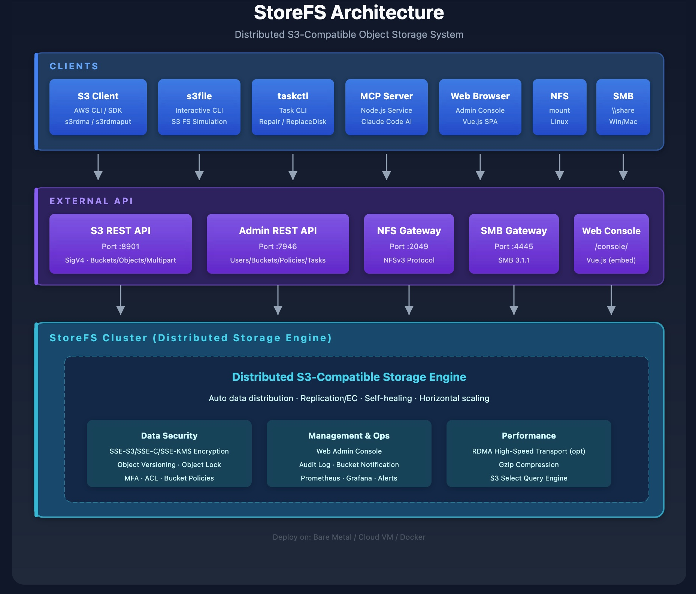

**[查看中文版](README_cn.md)**

<p align="center">
  
</p>

# StoreFS - Distributed S3-Compatible Storage System

## Index
- [Overview](#overview)
- [Installation and Deployment](#installation-and-deployment)
- [Management Console](#management-console)
- [User Roles and Groups](#user-roles-and-groups)
- [S3 API](#s3-api)
- [Admin API](#admin-api)
- [s3file CLI](#s3file-cli)
- [Gateway (NFS/SMB)](#gateway-nfssmb)
- [Monitoring](#monitoring)
- [MCP for AI Agent](#mcp-for-ai-agent)
- [Notification System](#notification-system)
- [Audit Log](#audit-log)
- [Task System](#task-system)
- [Quick Start](#quick-start)
- [Technical Support](#technical-support)
- [License](#license)

## Overview

StoreFS is a distributed S3-compatible storage system implemented in Go language, using gossip protocol for cluster membership management and communication. The system supports dynamic node management, data distribution, and fault tolerance functions, providing users with high-performance, scalable object storage services.
This project uses Claude Code to automatically generate all codes and documentation.

### Core Features

- **S3-Compatible API**: Compatible with AWS S3 API, supporting AWS CLI and other S3 tools
- **Distributed Architecture**: Node discovery and communication through gossip protocol
- **Dynamic Scalability**: Supports adding/removing nodes freely without downtime
- **High-Performance Storage**: Optimized storage engine supporting multiple storage media
- **RDMA Acceleration**: Get, put, and multipart upload all support RDMA for high-throughput object transfer
- **Fault Tolerance**: Data automatically recovers when nodes fail
- **Load Balancing**: Requests are automatically distributed to available nodes
- **Web Management Console**: Provides an intuitive web interface to manage users, policies, buckets, and objects
- **Multi-Language Support**: Management console supports Chinese and English
- **Security**: Supports object versioning (keeps historical versions and prevents accidental deletion), object locking (WORM model with Governance and Compliance modes), bucket-level AES-256-CTR encryption, and SSE-C (client-provided encryption keys) for data protection.
- **Gzip Compression**: PutObject and Multipart Upload support gzip-compressed request bodies via Content-Encoding header.
- **s3file CLI**: Interactive S3FS mode for browsing objects like a local file system, with Ctrl+C cancellation support.
- **Task Management**: Background task system for long-running administrative operations such as repairing corrupted fragments and replacing failed disks, with progress tracking and cancel support.
- **Node Taint**: Mark nodes as taint to prevent new data writes, or activate them back — useful for node maintenance, disk replacement, or troubleshooting scenarios.
- **Event Notifications**: Webhook-based event notifications for bucket-level object creation and deletion events. Supports configurable event types, object key prefix/suffix filters, HMAC-SHA256 signature verification, exponential backoff retry, and both native and AWS S3-compatible payload formats.

### Core Concepts

- **User**: System user with a unique identity. Each user has a role (`user`, `group_admin`, or `super_admin`) and usually belongs to a group. Users authenticate using Access Key (AK) and Secret Key (SK).

- **Role**: Determines the user's management scope and storage access behavior. Normal users manage their own resources, group administrators manage users and resources in their group, and super administrators manage global system configuration but do not directly access S3 object data.

- **Group**: Organizes users for delegated administration and shared policy defaults. A group can define a default policy that is applied when creating buckets without explicitly selecting a policy.

- **Policy**: Defines a user's access permissions to buckets and objects. Policies can precisely control user operations such as read, write, list bucket contents, delete objects, etc.

- **Bucket**: Container for storing objects. Each bucket has a unique name, and users can create, delete, and manage objects within buckets. Buckets can be configured with access policies to control which users can access them.

- **Versioning**: Bucket-level configuration that keeps historical versions of objects. When objects are overwritten or deleted, new versions or delete markers are created, allowing recovery to previous versions.

- **Object Lock**: Bucket-level WORM (Write Once, Read Many) configuration supporting two lock modes:
  - **Governance Mode**: Users with special permissions can overwrite or delete locked objects
  - **Compliance Mode**: No user can overwrite or delete locked objects until the retention period expires
  - Supports default retention policies automatically applied to newly uploaded objects

- **Encryption**: Bucket-level AES-256-CTR encryption (default: ON). Every object uploaded to an encrypted bucket is automatically encrypted with a unique AES-256 key generated per object. Encryption can be enabled or disabled at bucket creation or update time via the management console or admin API.

- **ACL**: S3-compatible bucket-level access control lists with five permissions (FULL_CONTROL, WRITE, READ, READ_ACP, WRITE_ACP) and three grantee types (CanonicalUser, AllUsers, AuthenticatedUsers). Can be managed via S3 XML API or Admin JSON API. For details, refer to: [ACL Documentation](docs/acl.md)

- **Tagging**: Key-value metadata that can be attached to buckets (up to 50 tags) and objects (up to 10 tags). Tags can be used for categorization, access control, and cost tracking. Supports get/set/delete operations via S3 API, with version-aware tagging when versioning is enabled.

- **S3 Select**: Allows querying structured object content (CSV and JSON) using SQL expressions without downloading the entire object. Supports SELECT, WHERE, LIMIT, aggregate functions (COUNT, SUM, AVG, MIN, MAX), and various SQL functions (SUBSTRING, TRIM, UPPER, LOWER, etc.). Also supports GZIP decompression.

- **Notification**: A bucket-level webhook configuration that fires HTTP POST requests when matching object events occur. Supports two payload formats (native and AWS S3-compatible), event type filtering, object key prefix/suffix filtering, and automatic retry with exponential backoff. Notifications are persisted in a delivery queue with at-least-once delivery guarantees and 3-day TTL.

- **Taint**: A node status that marks a node as unhealthy or under maintenance. Tainted nodes are excluded from new data writes and object placement, while existing data remains readable. Nodes can be manually tainted by an administrator (for maintenance or troubleshooting) or automatically tainted when all disks are full. The taint state is propagated across the cluster via gossip protocol.

- **Task**: A background administrative operation that runs on a target node for long-running maintenance activities. Tasks follow a lifecycle of Pending → Running → Completed / Failed / Cancelled. Supported task types include `repair` (scans and repairs corrupted file fragments) and `replacedisk` (migrates data from an old disk to a new disk).

### Cluster Architecture

A StoreFS cluster consists of multiple nodes that communicate through the gossip protocol:

- **Dynamic Node Management**: Supports adding/removing nodes freely without downtime
- **Data Distribution**: Object data is distributed to multiple nodes according to policies
- **Fault Tolerance**: Data automatically recovers when nodes fail
- **Load Balancing**: Requests are automatically distributed to available nodes



## Installation and Deployment

### 1. Configuration File Details

StoreFS uses a YAML format configuration file (config.yaml). Here is a detailed explanation of the configuration items:

```yaml
cluster:
  name: mycluster              # Cluster name, all nodes must use the same name
  db:                          # Database configuration (using StarRocks as metadata storage)
    host: "127.0.0.1"          # Database host address
    port: 9030                 # MySQL query port
    user: "root"               # Database username
    password: ""               # Database password
    database: "mydb"           # Database name
    timeout: 10s               # Connection timeout
  node:                        # Current node configuration
    name: node1                # Node name, must be unique
    num: 1                     # Node number, must be unique
    ip: 127.0.0.1              # Node IP address
    port: 7946                 # Reuse port. Admin REST API, admin web console, and node communication port (gossip protocol) all use this port
    internal_port: 17946       # Internal port for file operations between nodes
    disks:                     # Node disk configuration
      - path: /path/to/disk1   # Disk path
        weight: 1              # Disk weight for data distribution strategy
      - path: /path/to/disk2
        weight: 1
    s3:                        # S3 API configuration
      host: 127.0.0.1          # S3 API host address
      port: 8901               # S3 API port
  seeds:                       # Cluster seed node list (for node discovery)
    - 127.0.0.1:7946
    - 127.0.0.1:7947
    - 127.0.0.1:7948
```

### 2. Physical Machine/Cloud Virtual Machine Deployment

#### Step 1: Deploy Database

StoreFS uses StarRocks as metadata storage, so StarRocks needs to be deployed first:

```bash
# Download and start StarRocks (single-node deployment)
url: https://www.starrocks.io/download/community/index.html

tar -xzf StarRocks-<versiion>.tar.gz
cd StarRocks-<version>

# Start FE (Frontend)
./fe/bin/start_fe.sh --daemon

# Start BE (Backend)
./be/bin/start_be.sh --daemon

# Initialize metadata (using MySQL client to connect)
mysql -h db -P9030 -uroot < /init.sql
```

#### Step 2: Prepare Configuration File

Create a configuration file for each node (such as config1.yaml, config2.yaml, etc.), ensuring that `node.name` and `node.num` are unique for each node.

#### Step 3: Start StoreFS Nodes

```bash
# Download the StoreFS binary file for the corresponding platform
e.g., storefs_linux_x86_64

# Start node 1
./storefs_linux_x86_64 -config config1.yaml

# Start node 2 (in another terminal)
./storefs_linux_x86_64 -config config2.yaml

# Start node 3 (in another terminal)
./storefs_linux_x86_64 -config config3.yaml
```

### 3. Linux Binary Versions

Two Linux binary versions are available:

#### `storefs_linux` (Standard Version)
- **Requires**: No special dependencies! Works on any Linux system
- **Features**: Normal S3 functionality only
- **Use when**: You don't need RDMA or target system lacks libibverbs

#### `storefs_linux_rdma` (RDMA-Enabled Version)
- **IMPORTANT**: Will CRASH immediately if `libibverbs` is not installed on target system!
- **Requires**: `libibverbs` must be installed on target system
- **Features**: Full RDMA support for get, put, and multipart upload + normal S3 functionality
- **Use when**: You need high-performance RDMA data transfers

**How to check for libibverbs**:
```bash
ldconfig -p | grep libibverbs
```
If you see output, you have libibverbs and can use `storefs_linux_rdma`!

### 4. Docker Compose Deployment

StoreFS provides Docker Compose deployment for quickly starting a 3-node cluster:

```bash
# Prepare directories for Docker Volumes
./createDirs.sh
```

```bash
# Start Docker Compose
docker-compose up -d
```

Docker Compose will automatically start:
- 1 StarRocks database container
- 3 StoreFS node containers
- Port mapping: node1(7946/8901), node2(7947/8902), node3(7948/8903)

```bash
# Stop Docker Compose
docker-compose stop
```

```bash
# Clear Docker Compose containers
docker-compose down
rm -rf configs/db-init/
```

### 4. RDMA Support (Linux Only)

StoreFS supports RDMA (Remote Direct Memory Access) for high-performance data transfers, including get, put, and multipart upload. RDMA bypasses the operating system kernel and TCP/IP stack to achieve extremely low-latency and high-throughput data transfers.

Key features of RDMA support:
- GetObject, PutObject, and multipart UploadPart all support RDMA
- RDMA READ for put and multipart upload operations (server reads from client memory directly)
- RDMA WRITE for get operations (server writes to client memory directly)
- WebSocket control channel for RDMA connection setup
- Zero-copy data transfer
- Support for both hardware RDMA and Soft-RoCE (software emulation)

**Note**: RDMA support is Linux-only. It does not work on macOS, Windows, or other operating systems.

For detailed documentation about RDMA setup, configuration, and usage, please refer to:
- [RDMA Documentation](docs/rdma.md) - Detailed RDMA documentation in English

## Management Console

### Management Console Introduction

StoreFS provides a Vue.js-based web management console located in the `web` directory. The console provides an intuitive user interface for managing users, policies, buckets, and objects.

### Access Method

Visit `http://localhost:7946/console` with the default administrator account:
- Username: admin
- Password: admin123
- Role: `super_admin` (super admin)

### Features

| Function Module | Description | Screenshot |
|----------------|-------------|---------------------|
| User Management | Create/edit/delete users, manage access keys | [Login](docs/pics/login.jpg), [UserList](docs/pics/user.jpg), [GroupList](docs/pics/grouplist.jpg) |
| Policy Management | Create/edit/delete policies, configure permission rules | [PolicyList](docs/pics/policy.jpg) |
| Bucket Management | Create/edit/delete buckets, configure access policies, toggle encryption on/off | [BucketList](docs/pics/bucket.jpg) |
| | | [CreateVersionBucket](docs/pics/versionBucket.jpg) |
| Object Management | Upload/download/delete objects, preview file contents | [ObjectList](docs/pics/object.jpg), [ObjectInfo](docs/pics/objectinfo.jpg) |
| Object Versioning Management | Upload/download/delete objects, preview file contents | [ObjectVersionList](docs/pics/versionObjectList.jpg), [VersionList](docs/pics/versionList.jpg) |
| Multipart Management | Complete/abort | [MultipartList](docs/pics/multipart.jpg), [MultipartInfo](docs/pics/partdetail.jpg), [MultipartFragmentInfo](docs/pics/partfragment.jpg) |
| Task Management | Create task, Active/history task list | [TaskList](docs/pics/tasklist.jpg), [TaskDetail](docs/pics/taskdetail.jpg) |
| Node Management | View node status, Taint/active nodes | [NodeList](docs/pics/node.jpg) |
| Internationalization | Switch languages | [Internationalization](docs/pics/internationalization.jpg) |

## User Roles and Groups

### Overview

StoreFS uses role-based access control together with user groups. A user belongs to a group and receives one of three roles: `user`, `group_admin`, or `super_admin`. Groups make it possible to delegate administration by team or tenant, and each group can configure a default policy for buckets created by users in that group.

### Role Permissions

| Role | Management Console / Admin API Permissions | S3 API and Object Data Permissions | Group Scope |
|------|-------------------------------------------|------------------------------------|-------------|
| `user` | Manage own buckets, objects, profile, and access keys | Can access buckets owned by the user according to bucket policy | Own account and own buckets |
| `group_admin` | Manage users, buckets, objects, and group settings within the same group; can assign `user` and `group_admin` roles in the group | Can access buckets owned by users in the same group according to bucket policy | Current group only |
| `super_admin` | Manage all groups, users, policies, buckets, nodes, and global system resources; can create or assign `super_admin` users | Cannot directly access S3 API buckets or read/write object data; should delegate data operations to regular or group admin users | Global system scope |

> Note: Bucket policies still control the detailed S3 actions, such as read, write, list, and delete. Roles define the management boundary and the bucket ownership scope that a user can operate on.

## ACL (Access Control List)

StoreFS supports S3-compatible ACLs for bucket-level permission management, providing fine-grained access control for different users. ACL defines five permissions (FULL_CONTROL, WRITE, READ, READ_ACP, WRITE_ACP) and supports three grantee types (CanonicalUser, AllUsers, AuthenticatedUsers). It can be managed via the S3 XML API (GetBucketAcl / PutBucketAcl) or the Admin JSON API.

For details, refer to: [ACL Documentation](docs/acl.md)

## Tagging

StoreFS supports S3-compatible tagging for both buckets and objects. Tags are key-value pairs that can be used for categorization, access control, and cost tracking. Buckets support up to 50 tags and objects support up to 10 tags. Tags are version-aware when object versioning is enabled, and can be managed via the S3 XML API (GetBucketTagging / PutBucketTagging / DeleteBucketTagging). Tag behavior can be controlled during copy operations via the `x-amz-tagging-directive` header, and tags can be specified during multipart upload initialization.

For details, refer to: [Tagging Documentation](docs/tagging.md)

## S3 API

### Overview

StoreFS implements the core functions of the S3 API, compatible with AWS S3 clients and tools. You can use AWS CLI, S3 SDK, or other tools that support the S3 protocol to interact with StoreFS.

### Implemented API Interfaces

For detailed API interface documentation, please refer to: [S3 API Documentation](docs/s3.md)

Main implemented API interfaces include:

- **Bucket Operations**: Create bucket, list buckets, delete bucket
- **Object Operations**: Upload object, download object, delete object, list objects
- **Multipart Operations**: Create multipart upload, upload part, complete multipart upload, abort multipart upload, list parts, list multipart uploads
- **Versioning Operations**: Get bucket versioning status, set bucket versioning status
- **Object Lock Operations**: Get bucket object lock configuration, get object retention configuration
- **Tagging Operations**: Get/set/delete bucket tags, get/set/delete object tags (version-aware)
- **S3 Select Operations**: Query object content with SQL (CSV/JSON input/output, GZIP decompression)
- **ACL Operations**: Get/set bucket ACL (S3 XML API)
- **Event Notifications**: Object creation and deletion events are automatically fired and delivered to configured webhook endpoints (see [Notification Documentation](docs/notification.md))

### Public URI Reading

StoreFS supports public read access for objects in buckets marked as public. When a bucket is set to public, objects can be accessed directly via HTTP GET requests without authentication.

#### Enabling Public Access

A bucket can be marked as public during creation or updated later through:
- Admin API: Set `isPublic` field to `true` in bucket create/update requests
- Management Console: Toggle the "Public" switch in bucket settings

#### Public URI Formats

Objects in public buckets can be accessed using either path-style or virtual-hosted-style URIs:

**Path-style**:
```
http://<s3-host>:<s3-port>/<bucket-name>/<object-key>
```
Example: `http://127.0.0.1:8901/my-bucket/documents/report.pdf`

**Virtual-hosted-style**:
```
http://<bucket-name>.<s3-host>:<s3-port>/<object-key>
```
Example: `http://my-bucket.127.0.0.1:8901/documents/report.pdf`

#### How It Works

When StoreFS receives a GET request for an object:
1. If the bucket is public, it serves the object without requiring authentication
2. If the bucket is not public, it falls back to normal authentication checks

Public access only applies to GET requests for objects. All other operations (upload, delete, list, etc.) still require proper authentication and authorization.

## Admin API

### Overview

StoreFS provides a set of RESTful Admin APIs for managing the system's users, policies, buckets, and nodes. These APIs are mainly used for web management consoles and automated operations.

### Implemented API Interfaces

For detailed API interface documentation, please refer to: [Admin API Documentation](docs/admin-api.md)

Main implemented API interfaces include:

- **Authentication**: Login, logout, change password
- **User Management**: Create/delete users, modify user information, manage access keys
- **Policy Management**: Create/delete policies, modify policy content
- **Group Management**: Create/update/delete groups, configure default policies
- **Bucket Management**: Create/delete buckets, modify bucket attributes, list bucket contents (with ACL-aware permission fields: `userPermission`, `canReadAcl`, `canWrite`)
- **Object Management**: Manage objects in buckets, get object metadata, list object versions
- **Multipart Management**: List, get, complete, abort multipart uploads; get part fragment info
- **Bucket ACL Management**: Get/set bucket ACL via JSON API
- **Bucket Notification Management**: Create/update/delete/list bucket webhook notifications, test webhook endpoints
- **Node Management**: View node status, get taint status, update taint status
- **Task Management**: List task types, create/cancel/cleanup background tasks
- **Health Check**: Check cluster health status

## s3file CLI

### Overview

s3file is a command-line tool for interacting with S3-compatible storage services, supporting both interactive and silent modes. It works with StoreFS, MinIO, AWS S3, and all S3-compatible services.

### Features

- **Interactive Shell Mode**: Navigate S3 storage like a local file system
- **Silent Mode**: Execute commands programmatically
- **Multi-Provider Support**: Works with StoreFS, MinIO, AWS S3, and all S3-compatible services
- **Pagination Support**: Browse large directories with ease
- **Command History**: Navigate through previous commands
- **Auto-completion**: Tab completion for commands
- **Wildcard Support**: Use * and ? for fuzzy matching

### Documentation

For detailed documentation, please refer to: [s3file CLI Documentation](docs/s3file.md)

## Gateway (NFS/SMB)

### Overview

StoreFS provides NFSv3 and SMB 3.1.1 protocol gateways that allow you to mount and access your S3 buckets as a standard POSIX filesystem. This enables legacy applications, file servers, and operating systems to interact with StoreFS object storage without any S3 SDK integration.

### Key Features

- **NFSv3 Gateway**: Full NFSv3 protocol implementation with MOUNT protocol, supporting `none`, `sys`, and `krb5` authentication
- **SMB 3.1.1 Gateway**: Full SMB 3.1.1 protocol with SMB 2.1 backward compatibility, supporting NTLMSSP authentication and guest access
- **Unified VFS Layer**: Both gateways share a common virtual filesystem that translates POSIX operations to S3 object operations
- **S3 ↔ NFS/SMB Interoperability**: Data written through one protocol is immediately accessible through the others
- **User Mapping**: NFS/SMB client identities are mapped to StoreFS users for authentication and authorization
- **Read-Only Mode**: Both gateways can be configured as read-only exports
- **Directory Emulation**: S3 flat namespace is presented as a hierarchical filesystem with zero-byte marker objects

### Configuration Example

```yaml
gateway:
  nfs:
    enabled: true
    port: 2049
    export_path: "/"
    auth_type: "none"
    map_user: "user"
  smb:
    enabled: true
    port: 4445
    share_name: "storefs"
    guest_allowed: true
    map_user: "user"
```

### Quick Mount

```bash
# NFS mount (Linux)
sudo mount -t nfs -o vers=3,port=2049,noresvport <storefs-host>:/ /mnt/storefs

# SMB mount (Linux)
sudo mount -t cifs //<storefs-host>:4445/storefs /mnt/storefs \
  -o username=<user>,password=<pass>,vers=3.1.1
```

### Documentation

For detailed architecture, configuration, usage, and troubleshooting information, please refer to: [Gateway (NFS/SMB) Documentation](docs/gateway.md)

## Monitoring

StoreFS provides a comprehensive monitoring and alerting system based on the Prometheus + Grafana + Alertmanager stack.

### Key Features

- **Metrics Collection**: Each StoreFS node exposes a `/metrics` endpoint with system-level metrics (CPU, memory, disk, network), operation counters (object upload/download, multipart, fragment), and Go runtime metrics.
- **Hot Bucket Detection**: Real-time top-K hot bucket tracking using a sliding window algorithm (2-minute window), covering uploads, downloads, upload parts, and multipart completes.
- **Pre-built Grafana Dashboards**: Two pre-configured dashboards are included — a single-node detailed view and a cluster-wide summary view.
- **Alert Rules**: Pre-defined Prometheus alert rules for node down, disk usage, CPU/memory thresholds, and goroutine count.
- **Notification Channels**: Alertmanager configuration with templates for Slack, Email, and Webhook notifications (all disabled by default — easy to enable).

### Documentation

For detailed information, please refer to: [Monitoring Guide](docs/metrics.md)

## MCP for AI Agent

StoreFS provides an [MCP (Model Context Protocol)](https://modelcontextprotocol.io) server that enables AI assistants — primarily **Claude Code** — to manage the cluster through natural language. Instead of remembering API endpoints and request formats, you can simply describe what you want to do.

### Key Features

- **Natural Language Management**: Manage users, groups, buckets, policies, and objects by chatting with the AI
- **40+ Tools**: Six groups of tools covering cluster management, user administration, storage policies, bucket operations, object management, and S3 data operations
- **Automatic Language Detection**: Responses auto-switch between English and Chinese based on your input
- **Secure Authentication**: Bearer token for admin operations, AWS Signature V4 for S3 data operations
- **File Operations**: Upload, download, and copy files directly through natural language commands

### Prerequisites

- **Node.js >= 18**
- **StoreFS v0.3.7 or above**

### Documentation

For detailed information, please refer to: [MCP Server Guide](docs/mcp.md)

## Notification System

StoreFS provides a webhook-based event notification system that fires HTTP POST requests to configured endpoints when objects are created or deleted in a bucket. The system mirrors AWS S3 Event Notifications.

### Key Features

- **Real-time Events**: Object creation (PutObject, CopyObject, CompleteMultipartUpload) and deletion events are automatically detected and dispatched
- **Configurable Event Types**: Filter by specific event types (e.g., `s3:ObjectCreated:Put`, `s3:ObjectRemoved:Delete`) or use wildcards (`s3:ObjectCreated:*`, `*`)
- **Object Key Filtering**: Apply prefix and suffix filters to limit which objects trigger notifications
- **Two Payload Formats**: Native (simplified StoreFS format) and AWS S3-compatible format
- **HMAC-SHA256 Signing**: Optional secret-based payload signing for webhook endpoint verification
- **Automatic Retry**: Failed deliveries are retried with exponential backoff (1s → 5s → 30s → 5m → 30m)
- **Persistent Queue**: Events are queued in a database table with at-least-once delivery guarantees
- **MCP Integration**: Create and manage notifications through natural language

### Documentation

For detailed information, please refer to: [Notification System Documentation](docs/notification.md)

## Audit Log

StoreFS provides a comprehensive audit logging system that records all administrative and S3 data operations performed on the cluster. Every API request is captured with detailed metadata including who performed the action, what resource was affected, when it happened, the client IP, the HTTP status code, and the processing duration.

### Key Features

- **Automatic Capture**: Every Admin API and S3 API request is automatically logged with no application changes needed
- **Rich Metadata**: Records user identity, operation type, resource, client IP, status code, duration, request ID, and more
- **Multiple Outputs**: Supports database (StarRocks), syslog (local/remote), and file output destinations
- **Asynchronous Processing**: Audit entries are processed in the background via a buffered channel, never blocking request handling
- **Batch Inserts**: Database output uses batch inserts (100 entries or 1-second window) for efficient storage
- **Request Tracing**: Each request receives a unique `X-Request-ID` header for distributed tracing across the cluster
- **Configurable Filters**: Exclude health checks or set minimum duration thresholds to reduce noise
- **Automatic Cleanup**: Daily partition-based storage with configurable retention period and automatic cleanup
- **Operation Detection**: Automatically detects 50+ Admin API operations and 30+ S3 operations from HTTP method and path
- **Snowflake IDs**: Globally unique, time-sortable IDs for every audit entry

### Documentation

For detailed information, please refer to: [Audit Log Documentation](docs/auditlog.md)

## Task System

StoreFS provides a task system for long-running administrative operations on the cluster, such as repairing corrupted file fragments and replacing failed disks.

### Task Types

- **Repair Task** (`repair`): Scans and repairs corrupted or missing file fragments on a specified node. Supports both replica and erasure code (EC) policies — automatically reconstructs data from healthy nodes.
- **Replace Disk Task** (`replacedisk`): Migrates all data from an old disk to a new disk on the same node. Used when a physical disk needs replacement or upgrade.

### Key Features

- **Background Execution**: Tasks run asynchronously in the background with progress tracking
- **Per-Node Concurrency**: The same task type on different nodes can run simultaneously
- **Cancel Support**: Running tasks can be safely cancelled
- **Super Admin Only**: Repair and replace-disk operations require `super_admin` role
- **MCP Integration**: Create and manage tasks through natural language

### Documentation

For detailed information, please refer to: [Task System Documentation](docs/task.md)

## Quick Start

### 1. Connect Using s3file CLI

```bash
# Start interactive mode (connects to localhost:8901 by default)
s3file

# List all buckets
s3file --silent --command 'buckets'

# Create bucket and upload file using silent mode
s3file --silent --command 'mb mybucket' --command 'cd s3://mybucket' --command 'upload localfile.txt remote.txt'

# Download file using silent mode
s3file --silent --command 'cd s3://mybucket' --command 'download remote.txt localfile.txt'
```

For more detailed usage, please refer to: [s3file CLI Documentation](docs/s3file.md)

### 2. Connect Using AWS CLI

```bash
# Configure AWS CLI
aws configure --profile storefs
AWS Access Key ID [None]: <your-ak>
AWS Secret Access Key [None]: <your-sk>
Default region name [None]: us-east-1
Default output format [None]: json

# List all buckets
aws s3 ls --endpoint-url http://127.0.0.1:8901 --profile storefs

# Create bucket
aws s3 mb s3://mybucket --endpoint-url http://127.0.0.1:8901 --profile storefs

# Upload file
aws s3 cp localfile.txt s3://mybucket/ --endpoint-url http://127.0.0.1:8901 --profile storefs

# Download file
aws s3 cp s3://mybucket/localfile.txt . --endpoint-url http://127.0.0.1:8901 --profile storefs
```

### 3. Use Management Console

1. Visit `http://localhost:7946/console`
2. Log in with the default administrator account (username: admin, password: admin123, role: `super_admin`)
3. Create users, policies, and buckets
4. Manage your storage resources

## Technical Support

If you encounter problems while using StoreFS, please refer to:

1. [FAQ Documentation](docs/faq.md) - Frequently Asked Questions
2. [Troubleshooting](docs/troubleshooting.md) - Common Problem Troubleshooting
3. [GitHub Issues](https://github.com/bidzhao/sorefs/issues) - Submit Issue Reports

## License

You can use and distribute this software freely, but you need to retain the original author's copyright notice and license information.
