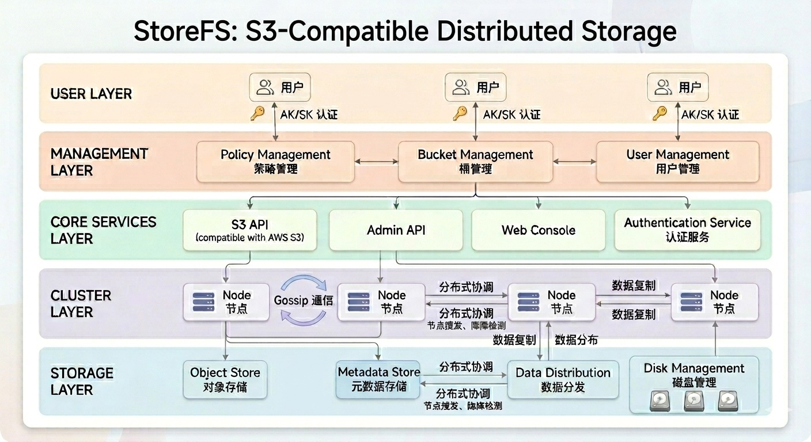

**[English](README.md)**

<p align="center">
  
</p>
# StoreFS - 分布式S3兼容存储系统

## 索引
- [概览](#概览)
- [安装与部署](#安装与部署)
- [管理控制台](#管理控制台)
- [S3 API](#s3-api)
- [Admin API](#admin-api)
- [快速开始](#快速开始)
- [技术支持](#技术支持)
- [许可证](#许可证)

## 概览

StoreFS是一个基于Go语言实现的分布式S3兼容存储系统，采用gossip协议实现集群成员管理和通信。系统支持动态节点管理、数据分布和容错功能，为用户提供高性能、可扩展的对象存储服务。
本项目使用Claude Code自动化生成全部代码和文档。

### 核心特点

- **S3兼容API**：兼容AWS S3 API，支持使用AWS CLI和其他S3工具
- **分布式架构**：通过gossip协议实现节点发现和通信
- **动态扩展**：支持自由添加/删除节点，无需停机维护
- **高性能存储**：优化的存储引擎，支持多种存储介质
- **容错机制**：节点故障时，数据会自动恢复
- **负载均衡**：请求会自动分发到可用节点
- **Web管理控制台**：提供直观的Web界面管理用户、策略、桶和对象
- **多语言支持**：管理控制台支持中文和英文

### 核心概念

- **User（用户）**：系统的使用者，拥有唯一的身份标识。每个用户可以有不同的角色（Role），角色决定了用户的权限范围。用户通过访问密钥（AK）和秘密密钥（SK）进行身份验证。

- **Policy（策略）**：定义了用户对桶（Bucket）和对象（Object）的访问权限。策略可以精确控制用户的操作权限，如读写、列出桶内容、删除对象等。

- **Bucket（桶）**：存储对象的容器。每个桶有唯一的名称，用户可以在桶中创建、删除和管理对象。桶可以配置访问策略，控制哪些用户可以访问。

### 集群架构

StoreFS集群由多个节点组成，节点之间通过gossip协议进行通信：

- **动态节点管理**：支持自由添加/删除节点，无需停机维护
- **数据分布**：对象数据会根据策略分布到多个节点上
- **容错机制**：节点故障时，数据会自动恢复
- **负载均衡**：请求会自动分发到可用节点



## 安装与部署

### 1. 配置文件详解

StoreFS使用YAML格式的配置文件（config.yaml），以下是配置项的详细说明：

```yaml
cluster:
  name: mycluster              # 集群名称，所有节点必须使用相同的名称
  db:                          # 数据库配置（使用StarRocks作为元数据存储）
    host: "127.0.0.1"          # 数据库主机地址
    port: 9030                 # MySQL查询端口
    user: "root"               # 数据库用户名
    password: ""               # 数据库密码
    database: "mydb"           # 数据库名称
    timeout: 10s               # 连接超时时间
  node:                        # 当前节点配置
    name: node1                # 节点名称，必须唯一
    num: 1                     # 节点编号，必须唯一
    ip: 127.0.0.1              # 节点IP地址
    port: 7946                 # 复用端口。admin rest api，admin web console, 以及节点通信端口（gossip协议）都使用这个端口
    internal_port: 17946       # 节点间文件操作的内部端口
    disks:                     # 节点的磁盘配置
      - path: /path/to/disk1   # 磁盘路径
        weight: 1              # 磁盘权重，用于数据分布策略
      - path: /path/to/disk2
        weight: 1
    s3:                        # S3 API配置
      host: 127.0.0.1          # S3 API主机地址
      port: 8901               # S3 API端口
  seeds:                       # 集群种子节点列表（用于节点发现）
    - 127.0.0.1:7946
    - 127.0.0.1:7947
    - 127.0.0.1:7948
```

### 2. 物理机/云虚拟机部署

#### 步骤1：部署数据库

StoreFS使用StarRocks作为元数据存储，需要先部署StarRocks：

```bash
# 下载并启动StarRocks（单节点部署）
wget https://repos-starrocks.azureedge.net/starrocks/4.0.7/StarRocks-4.0.7.tar.gz
tar -xzf StarRocks-4.0.7.tar.gz
cd StarRocks-4.0.7

# 启动FE（Frontend）
./fe/bin/start_fe.sh --daemon

# 启动BE（Backend）
./be/bin/start_be.sh --daemon

# 初始化元数据（使用MySQL客户端连接）
mysql -h db -P9030 -uroot < /init.sql
```

#### 步骤2：准备配置文件

为每个节点创建配置文件（如config1.yaml、config2.yaml等），确保每个节点的`node.name`和`node.num`唯一。

#### 步骤3：启动StoreFS节点

```bash
# 下载对应平台的StoreFS二进制文件
例如 storefs_linux_x86_64

# 启动节点1
./storefs_linux_x86_64 -config config1.yaml

# 启动节点2（在另一个终端）
./storefs_linux_x86_64 -config config2.yaml

# 启动节点3（在另一个终端）
./storefs_linux_x86_64 -config config3.yaml
```

### 3. Docker Compose部署

StoreFS提供了Docker Compose部署方式，快速启动一个3节点集群：

```bash
# 为Docker Volumes创建目录
./create_dirs.sh
```

```bash
# 启动Docker Compose
docker-compose up -d
```

Docker Compose会自动启动：
- 1个StarRocks数据库容器
- 3个StoreFS节点容器
- 端口映射：节点1(7946/8901)、节点2(7947/8902)、节点3(7948/8903)

```bash
# 停止Docker Compose
docker-compose stop
```

```bash
# 清除Docker Compose容器
docker-compose down
rm -rf configs/db-init/
```

## 管理控制台

### 管理控制台介绍

StoreFS提供了一个基于Vue.js的Web管理控制台，位于`web`目录下。控制台提供了直观的用户界面，用于管理用户、策略、桶和对象。

### 访问方式

访问`http://localhost:7946/console`，默认管理员账户为：
- 用户名：admin
- 密码：admin123

### 功能特性

| 功能模块 | 描述                | 截图位置 |
|------|-------------------|----------|
| 用户管理 | 创建/编辑/删除用户，管理访问密钥 | [登录](docs/pics/login.jpg), [用户列表](docs/pics/user.jpg) |
| 策略管理 | 创建/编辑/删除策略，配置权限规则 | [策略列表](docs/pics/policy.jpg) |
| 桶管理  | 创建/编辑/删除桶，配置访问策略  | [桶列表](docs/pics/bucket.jpg) |
| 对象管理 | 上传/下载/删除对象，预览文件内容 | [对象列表](docs/pics/object.jpg), [对象信息](docs/pics/objectinfo.jpg) |
| 分块管理 | 完成/取消 | [分块列表](docs/pics/multipart.jpg), [分块信息](docs/pics/partdetail.jpg), [分块分片信息](docs/pics/partfragment.jpg) |
| 节点管理 | 查看节点状态，添加/删除节点    | [节点列表](docs/pics/node.jpg) |
| 国际化  | 切换语言              | [国际化](docs/pics/internationalization.jpg) |

## S3 API

### 概要介绍

StoreFS实现了S3 API的核心功能，兼容AWS S3的客户端和工具。您可以使用AWS CLI、S3 SDK或其他支持S3协议的工具与StoreFS进行交互。

### 已实现的API接口

详细的API接口文档请参考：[S3 API 文档](docs/s3_cn.md)

主要实现的API接口包括：

- **桶操作**：创建桶、列出桶、删除桶
- **对象操作**：上传对象、下载对象、删除对象、列出对象
- **分块操作**：创建分块上传、上传分块、完成分块上传、取消分块上传、列出分块、列出分块上传

## Admin API

### 概要介绍

StoreFS提供了一套RESTful Admin API，用于管理系统的用户、策略、桶和节点。这些API主要用于Web管理控制台和自动化运维。

### 已实现的API接口

详细的API接口文档请参考：[Admin API 文档](docs/admin-api_cn.md)

主要实现的API接口包括：

- **认证**：登录、登出、修改密码
- **用户管理**：创建/删除用户、修改用户信息、管理访问密钥
- **策略管理**：创建/删除策略、修改策略内容
- **桶管理**：创建/删除桶、修改桶属性、列出桶内容
- **对象管理**：管理桶中的对象、获取对象元数据
- **节点管理**：查看节点状态、管理集群节点

## 快速开始

### 1. 使用AWS CLI连接

```bash
# 配置AWS CLI
aws configure --profile storefs
AWS Access Key ID [None]: <your-ak>
AWS Secret Access Key [None]: <your-sk>
Default region name [None]: us-east-1
Default output format [None]: json

# 列出所有桶
aws s3 ls --endpoint-url http://127.0.0.1:8901 --profile storefs

# 创建桶
aws s3 mb s3://mybucket --endpoint-url http://127.0.0.1:8901 --profile storefs

# 上传文件
aws s3 cp localfile.txt s3://mybucket/ --endpoint-url http://127.0.0.1:8901 --profile storefs

# 下载文件
aws s3 cp s3://mybucket/localfile.txt . --endpoint-url http://127.0.0.1:8901 --profile storefs
```

### 2. 使用管理控制台

1. 访问`http://localhost:7946/console`
2. 使用默认管理员账户登录（用户名：admin，密码：admin123）
3. 创建用户、策略和桶
4. 管理您的存储资源

## 技术支持

如果您在使用StoreFS过程中遇到问题，请参考：

1. [FAQ文档](docs/faq_cn.md) - 常见问题解答
2. [故障排除](docs/troubleshooting_cn.md) - 常见问题排查
3. [GitHub Issues](https://github.com/bidzhao/storefs/issues) - 提交问题报告

## 许可证

您可以自由使用和分发本软件，但需要保留原作者的版权声明和许可信息。
