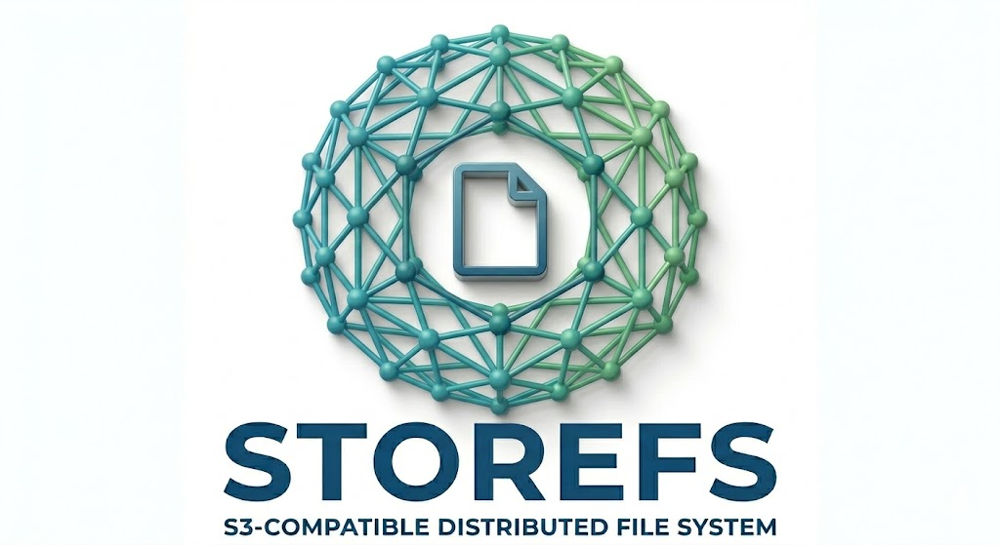
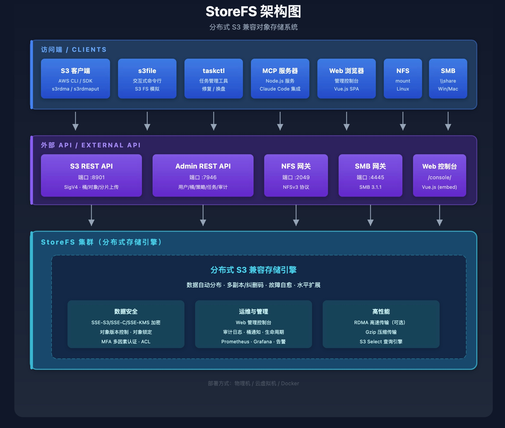

**[English](README.md)**

<p align="center">
  
</p>
# StoreFS - 分布式S3兼容存储系统

## 索引
- [概览](#概览)
- [安装与部署](#安装与部署)
- [管理控制台](#管理控制台)
- [用户角色与用户组](#用户角色与用户组)
- [S3 API](#s3-api)
- [Admin API](#admin-api)
- [s3file CLI](#s3file-cli)
- [快速开始](#快速开始)
- [技术支持](#技术支持)
- [许可证](#许可证)

## 概览

StoreFS是一个基于Go语言实现的分布式S3兼容存储系统，采用gossip协议实现集群成员管理和通信。系统支持动态节点管理、数据分布和容错功能，为用户提供高性能、可扩展的对象存储服务。
本项目使用Claude Code自动化生成全部代码和文档。

### 核心特点

- **S3兼容API**：兼容AWS S3 API，支持使用AWS CLI和其他S3工具
- **分布式架构**：通过gossip协议实现节点发现和通信
- **动态扩展**：支持自由添加/删除节点，无需停机维护
- **高性能存储**：优化的存储引擎，支持多种存储介质
- **RDMA加速**：get、put和multipart upload均支持RDMA，用于高吞吐对象传输
- **容错机制**：节点故障时，数据会自动恢复
- **负载均衡**：请求会自动分发到可用节点
- **Web管理控制台**：提供直观的Web界面管理用户、策略、桶和对象
- **多语言支持**：管理控制台支持中文和英文
- **安全特性**：支持对象版本控制（保留历史版本，防止意外删除）、对象锁定（WORM模型，提供治理和合规两种模式）、桶级别 AES-256-CTR 加密以及 SSE-C（客户端提供加密密钥），全方位保护数据安全。
- **Gzip压缩传输**：PutObject 和 Multipart Upload 支持通过 Content-Encoding 头传输 gzip 压缩的请求体。
- **s3file CLI**：交互式 S3FS 模式，像操作本地文件系统一样浏览对象，支持 Ctrl+C 取消操作。

### 核心概念

- **User（用户）**：系统的使用者，拥有唯一的身份标识。每个用户都有角色（`user`、`group_admin` 或 `super_admin`），通常归属于一个用户组。用户通过访问密钥（AK）和秘密密钥（SK）进行身份验证。

- **Role（角色）**：决定用户的管理范围和存储访问行为。普通用户管理自己的资源，用户组管理员管理本组内的用户和资源，超级管理员管理全局系统配置但不直接访问 S3 对象数据。

- **Group（用户组）**：用于组织用户、委派管理权限和配置共享的默认策略。用户组可以设置默认策略，在创建桶且未显式选择策略时自动使用。

- **Policy（策略）**：定义了用户对桶（Bucket）和对象（Object）的访问权限。策略可以精确控制用户的操作权限，如读写、列出桶内容、删除对象等。

- **Bucket（桶）**：存储对象的容器。每个桶有唯一的名称，用户可以在桶中创建、删除和管理对象。桶可以配置访问策略，控制哪些用户可以访问。

- **Versioning（版本控制）**：桶级别的配置，启用后会保留对象的历史版本。当对象被覆盖或删除时，会创建新的版本或删除标记，允许恢复到之前的版本。

- **Object Lock（对象锁定）**：桶级别的WORM（Write Once, Read Many）配置，支持两种锁定模式：
  - **Governance Mode（治理模式）**：特定权限用户可以覆盖或删除锁定对象
  - **Compliance Mode（合规模式）**：任何用户都不能覆盖或删除锁定对象，直到保留期结束
  - 支持默认保留策略，自动应用于新上传的对象

- **Encryption（加密）**：桶级别的 AES-256-CTR 加密（默认：开启）。上传到加密桶的每个对象都会自动生成唯一的 AES-256 密钥并加密存储。可以通过管理控制台或管理 API 在创建或编辑桶时开启或关闭加密。

### 集群架构

StoreFS集群由多个节点组成，节点之间通过gossip协议进行通信：

- **动态节点管理**：支持自由添加/删除节点，无需停机维护
- **数据分布**：对象数据会根据策略分布到多个节点上
- **容错机制**：节点故障时，数据会自动恢复
- **负载均衡**：请求会自动分发到可用节点



## 安装与部署

### 1. 配置文件详解

StoreFS使用YAML格式的配置文件（config.yaml），以下是配置项的详细说明：

```yaml
cluster:
  name: mycluster              # 集群名称，所有节点必须使用相同的名称
  db:                          # 数据库配置（使用StarRocks作为元数据存储）
    host: "127.0.0.1"          # 数据库主机地址
    port: 9030                 # MySQL查询端口
    user: "root"               # 数据库用户名
    password: ""               # 数据库密码
    database: "mydb"           # 数据库名称
    timeout: 10s               # 连接超时时间
  node:                        # 当前节点配置
    name: node1                # 节点名称，必须唯一
    num: 1                     # 节点编号，必须唯一
    ip: 127.0.0.1              # 节点IP地址
    port: 7946                 # 复用端口。admin rest api，admin web console, 以及节点通信端口（gossip协议）都使用这个端口
    internal_port: 17946       # 节点间文件操作的内部端口
    disks:                     # 节点的磁盘配置
      - path: /path/to/disk1   # 磁盘路径
        weight: 1              # 磁盘权重，用于数据分布策略
      - path: /path/to/disk2
        weight: 1
    s3:                        # S3 API配置
      host: 127.0.0.1          # S3 API主机地址
      port: 8901               # S3 API端口
  seeds:                       # 集群种子节点列表（用于节点发现）
    - 127.0.0.1:7946
    - 127.0.0.1:7947
    - 127.0.0.1:7948
```

### 2. 物理机/云虚拟机部署

#### 步骤1：部署数据库

StoreFS使用StarRocks作为元数据存储，需要先部署StarRocks：

```bash
# 下载并启动StarRocks（单节点部署）
url: https://www.starrocks.io/download/community/index.html

tar -xzf StarRocks-<versiion>.tar.gz
cd StarRocks-<version>

# 启动FE（Frontend）
./fe/bin/start_fe.sh --daemon

# 启动BE（Backend）
./be/bin/start_be.sh --daemon

# 初始化元数据（使用MySQL客户端连接）
mysql -h db -P9030 -uroot < /init.sql
```

#### 步骤2：准备配置文件

为每个节点创建配置文件（如config1.yaml、config2.yaml等），确保每个节点的`node.name`和`node.num`唯一。

#### 步骤3：启动StoreFS节点

```bash
# 下载对应平台的StoreFS二进制文件
例如 storefs_linux_x86_64

# 启动节点1
./storefs_linux_x86_64 -config config1.yaml

# 启动节点2（在另一个终端）
./storefs_linux_x86_64 -config config2.yaml

# 启动节点3（在另一个终端）
./storefs_linux_x86_64 -config config3.yaml
```

### 3. Linux二进制版本说明

提供两个Linux二进制版本：

#### `storefs_linux`（标准版）
- **运行要求**：无特殊依赖！可在任何Linux系统上运行
- **功能**：仅普通S3功能
- **适用场景**：不需要RDMA或目标系统缺少libibverbs时

#### `storefs_linux_rdma`（RDMA版）
- **重要警告**：如果目标系统没有安装 `libibverbs`，程序会立即崩溃！
- **运行要求**：目标系统必须安装 `libibverbs`
- **功能**：get、put和multipart upload均支持RDMA + 普通S3功能
- **适用场景**：需要高性能RDMA数据传输时

**检查系统是否有libibverbs**：
```bash
ldconfig -p | grep libibverbs
```
如果有输出，说明系统有libibverbs，可以使用`storefs_linux_rdma`！

### 4. Docker Compose部署

StoreFS提供了Docker Compose部署方式，快速启动一个3节点集群：

```bash
# 为Docker Volumes创建目录
./create_dirs.sh
```

```bash
# 启动Docker Compose
docker-compose up -d
```

Docker Compose会自动启动：
- 1个StarRocks数据库容器
- 3个StoreFS节点容器
- 端口映射：节点1(7946/8901)、节点2(7947/8902)、节点3(7948/8903)

```bash
# 停止Docker Compose
docker-compose stop
```

```bash
# 清除Docker Compose容器
docker-compose down
rm -rf configs/db-init/
```

### 4. RDMA支持（仅Linux）

StoreFS支持RDMA（远程直接内存访问）用于高性能数据传输，get、put和multipart upload均支持RDMA。RDMA绕过操作系统内核和TCP/IP协议栈，实现极低延迟和极高吞吐量的数据传输。

RDMA支持的主要特性：
- GetObject、PutObject和multipart UploadPart均支持RDMA
- RDMA READ用于put和multipart upload操作（服务器直接从客户端内存读取）
- RDMA WRITE用于get操作（服务器直接写入客户端内存）
- WebSocket控制通道用于RDMA连接建立
- 零拷贝数据传输
- 支持硬件RDMA和Soft-RoCE（软件仿真）

**注意**：RDMA支持仅适用于Linux。在macOS、Windows或其他操作系统上无法使用。

有关RDMA设置、配置和使用的详细文档，请参考：
- [RDMA 文档](docs/rdma_cn.md) - 详细的中文RDMA文档

## 管理控制台

### 管理控制台介绍

StoreFS提供了一个基于Vue.js的Web管理控制台，位于`web`目录下。控制台提供了直观的用户界面，用于管理用户、策略、桶和对象。

### 访问方式

访问`http://localhost:7946/console`，默认管理员账户为：
- 用户名：admin
- 密码：admin123
- 角色：`super_admin`（超级管理员）

### 功能特性

| 功能模块 | 描述                | 截图 |
|------|-------------------|----------|
| 用户管理 | 创建/编辑/删除用户，管理访问密钥 | [登录](docs/pics/login.jpg), [用户列表](docs/pics/user.jpg), [组列表](docs/pics/grouplist.jpg)|
| 策略管理 | 创建/编辑/删除策略，配置权限规则 | [策略列表](docs/pics/policy.jpg) |
| 桶管理  | 创建/编辑/删除桶，配置访问策略，开启/关闭加密 | [桶列表](docs/pics/bucket.jpg) |
| | | [添加桶（版本）](docs/pics/versionBucket.jpg) |
| 对象管理 | 上传/下载/删除对象，预览文件内容 | [对象列表](docs/pics/object.jpg), [对象信息](docs/pics/objectinfo.jpg) |
| 版本对象管理 | 上传/下载/删除对象，预览文件内容 | [对象（版本）列表](docs/pics/versionObjectList.jpg), [版本列表](docs/pics/versionList.jpg) |
| 分块管理 | 完成/取消 | [分块列表](docs/pics/multipart.jpg), [分块信息](docs/pics/partdetail.jpg), [分块分片信息](docs/pics/partfragment.jpg) |
| 节点管理 | 查看节点状态，添加/删除节点    | [节点列表](docs/pics/node.jpg) |
| 国际化  | 切换语言              | [国际化](docs/pics/internationalization.jpg) |

## 用户角色与用户组

### 概要介绍

StoreFS 使用基于角色的访问控制（RBAC）并结合用户组进行权限隔离。用户属于某个用户组，并拥有 `user`、`group_admin` 或 `super_admin` 三种角色之一。用户组可用于按团队或租户委派管理权限，并可配置默认策略，供组内用户创建桶且未显式选择策略时使用。

### 角色权限

| 角色 | 管理控制台 / Admin API 权限 | S3 API 与对象数据权限 | 作用范围 |
|------|----------------------------|-----------------------|----------|
| `user` | 管理自己的桶、对象、个人资料和访问密钥 | 可按桶策略访问自己拥有的桶 | 当前用户及其拥有的桶 |
| `group_admin` | 管理同组内的用户、桶、对象和用户组设置；可在组内分配 `user` 和 `group_admin` 角色 | 可按桶策略访问同组用户拥有的桶 | 当前用户组 |
| `super_admin` | 管理所有用户组、用户、策略、桶、节点和全局系统资源；可创建或分配 `super_admin` 用户 | 不能直接访问 S3 API 桶或读写对象数据；数据操作应委派给普通用户或用户组管理员 | 全局系统范围 |

> 注意：桶策略仍然控制具体的 S3 操作，例如读、写、列出和删除。角色用于定义管理边界以及用户可以操作的桶所有权范围。

## S3 API

### 概要介绍

StoreFS实现了S3 API的核心功能，兼容AWS S3的客户端和工具。您可以使用AWS CLI、S3 SDK或其他支持S3协议的工具与StoreFS进行交互。

### 已实现的API接口

详细的API接口文档请参考：[S3 API 文档](docs/s3_cn.md)

主要实现的API接口包括：

- **桶操作**：创建桶、列出桶、删除桶
- **对象操作**：上传对象、下载对象、删除对象、列出对象
- **分块操作**：创建分块上传、上传分块、完成分块上传、取消分块上传、列出分块、列出分块上传
- **版本控制操作**：获取桶版本控制状态、设置桶版本控制状态
- **对象锁定操作**：获取桶对象锁定配置、获取对象保留配置

### 公共URI读取

StoreFS支持对标记为公开的桶中的对象进行公开读取访问。当桶设置为公开时，可以通过HTTP GET请求直接访问对象，无需身份验证。

#### 启用公开访问

可以在创建桶或稍后更新时将桶标记为公开：
- 管理API：在桶创建/更新请求中将`isPublic`字段设置为`true`
- 管理控制台：在桶设置中切换"公开"开关

#### 公共URI格式

可以使用路径样式或虚拟主机样式URI访问公共桶中的对象：

**路径样式**：
```
http://<s3主机>:<s3端口>/<桶名称>/<对象键>
```
示例：`http://127.0.0.1:8901/my-bucket/documents/report.pdf`

**虚拟主机样式**：
```
http://<桶名称>.<s3主机>:<s3端口>/<对象键>
```
示例：`http://my-bucket.127.0.0.1:8901/documents/report.pdf`

#### 工作原理

当StoreFS接收到对象的GET请求时：
1. 如果桶是公开的，则无需身份验证直接提供对象
2. 如果桶不是公开的，则回退到正常的身份验证检查

公开访问仅适用于对象的GET请求。所有其他操作（上传、删除、列出等）仍需要适当的身份验证和授权。

## Admin API

### 概要介绍

StoreFS提供了一套RESTful Admin API，用于管理系统的用户、策略、桶和节点。这些API主要用于Web管理控制台和自动化运维。

### 已实现的API接口

详细的API接口文档请参考：[Admin API 文档](docs/admin-api_cn.md)

主要实现的API接口包括：

- **认证**：登录、登出、修改密码
- **用户管理**：创建/删除用户、修改用户信息、管理访问密钥
- **策略管理**：创建/删除策略、修改策略内容
- **桶管理**：创建/删除桶、修改桶属性、列出桶内容
- **对象管理**：管理桶中的对象、获取对象元数据
- **节点管理**：查看节点状态、管理集群节点

## s3file CLI

### 概要

s3file 是一个用于与 S3 兼容存储服务交互的命令行工具，支持交互式和静默两种模式。它适用于 StoreFS、MinIO、AWS S3 以及所有 S3 兼容服务。

### 功能特性

- **交互式 Shell 模式**：像操作本地文件系统一样浏览 S3 存储
- **静默模式**：编程方式执行命令
- **多供应商支持**：适用于 StoreFS、MinIO、AWS S3 以及所有 S3 兼容服务
- **分页支持**：轻松浏览大型目录
- **命令历史**：浏览之前执行过的命令
- **自动补全**：命令的 Tab 补全功能
- **通配符支持**：使用 * 和 ? 进行模糊匹配

### 文档

详细文档请参考：[s3file CLI 文档](docs/s3file_cn.md)

## 快速开始

### 1. 使用 s3file CLI 连接

```bash
# 启动交互式模式（默认连接到 localhost:8901）
s3file

# 列出所有存储桶
s3file --silent --command 'buckets'

# 使用静默模式创建存储桶并上传文件
s3file --silent --command 'mb mybucket' --command 'cd s3://mybucket' --command 'upload localfile.txt remote.txt'

# 使用静默模式下载文件
s3file --silent --command 'cd s3://mybucket' --command 'download remote.txt localfile.txt'
```

更详细的使用方法请参考：[s3file CLI 文档](docs/s3file_cn.md)

### 2. 使用AWS CLI连接

```bash
# 配置AWS CLI
aws configure --profile storefs
AWS Access Key ID [None]: <your-ak>
AWS Secret Access Key [None]: <your-sk>
Default region name [None]: us-east-1
Default output format [None]: json

# 列出所有桶
aws s3 ls --endpoint-url http://127.0.0.1:8901 --profile storefs

# 创建桶
aws s3 mb s3://mybucket --endpoint-url http://127.0.0.1:8901 --profile storefs

# 上传文件
aws s3 cp localfile.txt s3://mybucket/ --endpoint-url http://127.0.0.1:8901 --profile storefs

# 下载文件
aws s3 cp s3://mybucket/localfile.txt . --endpoint-url http://127.0.0.1:8901 --profile storefs
```

### 3. 使用管理控制台

1. 访问`http://localhost:7946/console`
2. 使用默认管理员账户登录（用户名：admin，密码：admin123，角色：`super_admin`）
3. 创建用户、策略和桶
4. 管理您的存储资源

## 技术支持

如果您在使用StoreFS过程中遇到问题，请参考：

1. [FAQ文档](docs/faq_cn.md) - 常见问题解答
2. [故障排除](docs/troubleshooting_cn.md) - 常见问题排查
3. [GitHub Issues](https://github.com/bidzhao/storefs/issues) - 提交问题报告

## 许可证

您可以自由使用和分发本软件，但需要保留原作者的版权声明和许可信息。
